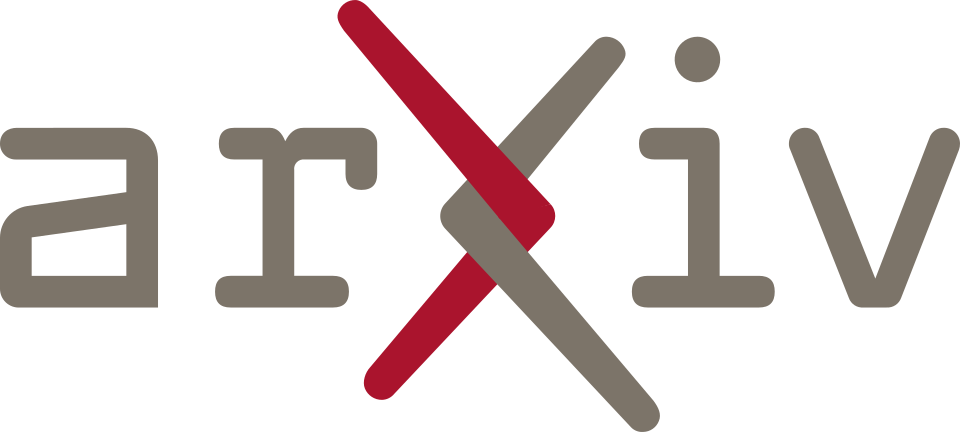
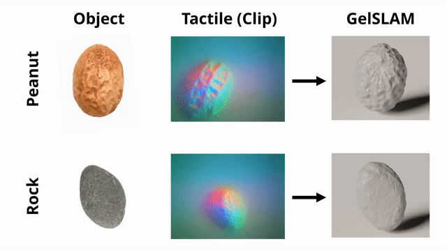
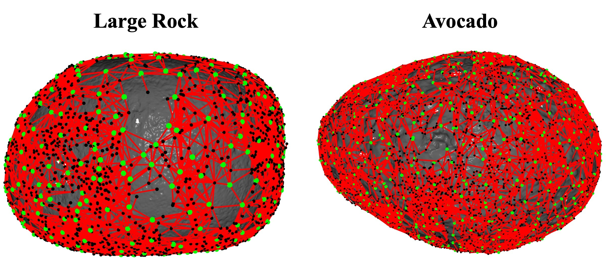

<h1 align="center">
    GelSLAM: A Real-Time, High-Fidelity, and Robust <br/> 3D Tactile SLAM System
</h1>

<div align="center">
  <a href="https://joehjhuang.github.io/" target="_blank">Hung-Jui Huang</a> &nbsp;•&nbsp;
  <a href="https://www.aminmirzaee.com/" target="_blank">Mohammad Amin Mirzaee</a> &nbsp;•&nbsp;
  <a href="https://www.cs.cmu.edu/~kaess/" target="_blank">Michael Kaess</a> &nbsp;•&nbsp;
  <a href="https://siebelschool.illinois.edu/about/people/all-faculty/yuanwz" target="_blank">Wenzhen Yuan</a>
</div>

<h4 align="center">
  <a href="https://joehjhuang.github.io/gelslam"> <b>Website</b></a> &nbsp;&nbsp;&nbsp;&nbsp;
  <a href="https://arxiv.org/abs/2508.15990"> <b>Paper</b></a> &nbsp;&nbsp;&nbsp; &nbsp;
  🤗 <a href="https://huggingface.co/datasets/joehjhuang/GelSLAM_dataset"> <b>Dataset</b></a>
</h4>


<div align="center">
<br>

[](https://opensource.org/licenses/MIT) &nbsp; 
<a href="https://rpl.ri.cmu.edu/" target="_blank">
  
</a>
</div>

<p align="center">
  
</p>

GelSLAM is a real-time 3D SLAM system that enables ultra-high-fidelity object shape reconstruction and precise object pose tracking relying on tactile sensing alone. It accomplishes what was previously out of reach for tactile-only systems. For more details and results, please visit our [website](https://joehjhuang.github.io/gelslam) and the [arXiv paper](https://arxiv.org/abs/2508.15990). 

---

### 💻 System Requirements
The codebase has been tested with the following configuration. While other versions may work, they have not been verified.

- **OS**: Ubuntu 22.04
- **Python**: 3.10.12
- **ROS**: ROS 2 Humble (Desktop Full)
  - We recommend a system-wide installation for all components (ROS 2, GTSAM, and Python dependencies) because ROS 2 is difficult to configure within virtual environments. Usage with virtual environments is not verified.
- **GTSAM**: 4.3.0
  - Must be compiled with Python bindings enabled (`-DGTSAM_BUILD_PYTHON=1`).
  - Refer to the [GTSAM Python Installation Guide](https://github.com/borglab/gtsam/tree/develop/python) for detailed instructions.

---

### 🛠️ Installation
1.  **Install Python Dependencies**:
    ```bash
    pip install -r requirements.txt
    ```

2.  **Build GelSLAM**:
    ```bash
    colcon build
    source install/setup.bash
    ```

---

### ⚡ Quick Start

Experience GelSLAM’s real-time reconstruction by replaying our sample GelSight video of scanning a seed. The video streams tactile images at the sensor's native frame rate to simulate live hardware input. To run a live demo on your own GelSight Mini sensor or reproduce the paper reconstruction results, see [Running GelSLAM](#-running-gelslam) and [Reproduce Paper Results](#-reproduce-paper-results).

1.  **Download Sample Data**:
    ```bash
    bash download_sample_data.sh
    

2.  **Run Real-Time Reconstruction**:
    ```bash
    ros2 launch gelslam live_replay_demo_launch.py data_dir:=data/sample_data/example_scan config_path:=data/sample_data/example_scan/config.yaml
    ```

A window will open displaying the live reconstruction. After playback finishes, the final mesh is saved to `data/sample_data/example_scan/gelslam_online/reconstructed_mesh.ply`.

---

### 📌 Prerequisites
Please calibrate your sensor and prepare a configuration file before running GelSLAM on your own data or sensors.

- **Sensor Calibration**:  
  Calibrate your sensor using the [GelSight SDK](https://github.com/joehjhuang/gs_sdk). **Re-calibration is required if the GelPad is replaced or a different sensor is used.** Calibration typically takes under one hour. An example calibration is provided at `src/gelslam/resources/example_calibration/`.

- **Configuration File**:  
  Copy `src/gelslam/config/config.yaml` to your data directory and set `calibration_model_path` to your calibration model path (the `model/nnmodel.pth` in your calibration directory). Other parameters usually do not need to be changed.

---

### 🚀 Running GelSLAM
GelSLAM supports three reconstruction modes depending on the tactile data source and use case. Before running GelSLAM, please ensure you have gone through the steps in [Prerequisites](#-prerequisites).

| Mode | Tactile Source | Online/Offline | Use Case |
|---|---|---|---|
| Live | Physical sensor | Online | Interactive, short scans (<10 min) |
| Live Replay | Recorded video | Online | short scans (<10 min) |
| Offline | Recorded video | Offline | Best quality, long scans (>10 min) |

### 🟢 Mode 1: Live Reconstruction

<p align="center">
  
  <br>
  Live GelSLAM reconstruction demo, filmed live without post-processing.
</p>

Run real-time reconstruction directly on your own GelSight Mini sensor.
```bash
ros2 launch gelslam live_demo_launch.py data_dir:=<path_to_save_data> config_path:=<path_to_config>
```

  | Argument | Required | Description |
  |---|:---:|---|
  | `data_dir` | **Yes** | Where the recorded video and results will be saved |
  | `config_path` | **Yes** | Path to the GelSLAM configuration file |
  | `rendering` | No | Rendering the reconstruction progress, see [Notes](#%EF%B8%8F-notes) (default: `true`) |
  | `streamer` | No | `ffmpeg` or `cv2` (default: `ffmpeg`) |
  | `skip_background_check` | No | Skip background image confirmation, see [Notes](#%EF%B8%8F-notes) (default: `false`) |
  | `save_gelslam_states` | No | Save the GelSLAM states (default: `false`) |

- **Instructions**
  - **After launch, wait about 3 seconds before scanning to allow background capture.** Confirm the background capture is correct.
  - GelSLAM uses an FFmpeg streamer at 25 Hz by default. **On some systems, this may cause frame delay after only 40 seconds of streaming. If so, set `streamer:=cv2`, which streams at ~10 Hz. Scans slower in this case.**
  - Press `Ctrl+C` to stop scanning at any time.

- **Output**  
  After stopping, GelSLAM fuses and saves the reconstructed mesh to `<data_dir>/gelslam_online/reconstructed_mesh.ply`. For long scans, this may take up to one minute.

### 🟢 Mode 2: Live Replay Reconstruction
Run real-time reconstruction by replaying a recorded GelSight video. Tactile images are streamed at the sensor’s native frame rate to simulate live input.
```bash
ros2 launch gelslam live_replay_demo_launch.py data_dir:=<path_to_recorded_data> config_path:=<path_to_config>
```

  | Argument | Required | Description |
  |---|:---:|---|
  | `data_dir` | **Yes** | Containing the GelSight video and where results will be saved |
  | `config_path` | **Yes** | Path to the GelSLAM configuration file |
  | `rendering` | No | Rendering the reconstruction progress, see [Notes](#%EF%B8%8F-notes) (default: `true`) |
  | `skip_background_check` | No | Skip background image confirmation, see [Notes](#%EF%B8%8F-notes) (default: `true`) |
  | `save_gelslam_states` | No | Save the GelSLAM states (default: `false`) |

- **Instructions**
  - Place the GelSight video in `data_dir` and name it `gelsight.avi`. **Ensure no contact occurs during the first 10 frames, which are used as GelSight background.**
  - Once the video stream ended, the process will terminate itself. Otherwise, you may press **Ctrl+C** to stop at any time.

- **Output**  
  After completion (or early termination), GelSLAM fuses and saves the reconstructed mesh to: `<data_dir>/gelslam_online/reconstructed_mesh.ply`. For long videos, this may take up to a minute.

### 🟢 Mode 3: Offline Reconstruction
Run offline reconstruction on a recorded GelSight video.

```bash
ros2 run gelslam gelslam_offline -d <path_to_data> -c <path_to_config>
```

  | Argument | Required | Description |
  |---|:---:|---|
  | `data_dir` | **Yes** | Containing the GelSight video and where results will be saved |
  | `config_path` | **Yes** | Path to the GelSLAM configuration file |
  | `rendering` | No | Rendering the reconstruction progress, see [Notes](#%EF%B8%8F-notes) (default: `false`) |
  | `save_gelslam_states` | No | Save the GelSLAM states (default: `false`) |

- **Instructions**
  - Place the GelSight video in `data_dir` and name it `gelsight.avi`. **Ensure no contact occurs during the first 10 frames, which are used as GelSight background.**
  - The process terminates automatically once the reconstruction ends.
  - For extremely long videos (>30 minutes), memory usage may become a concern, as the recorded video itself can be several gigabytes.

- **Output**  
  After completion, the reconstructed mesh is saved to: `<data_dir>/gelslam_offline/reconstructed_mesh.ply`.

### ⚠️ Notes

- GelSLAM requires a background image captured from the first few frames. New users are asked to confirm the background image before continuing. Set `skip_background_check:=true` to skip background confirmation.
- The `rendering` option is for displaying the reconstruction progress and is not part of the GelSLAM algorithm. When the meshes grow large (which can reach gigabytes), rendering it can slow down the system and affects GelSLAM performance.
- If `rendering:=true`, the rendering resolution is automatically reduced as the mesh grows, but the underlying reconstructed mesh is kept at full resolution.
- For very large objects that requires scans longer than 10 minutes, we recommend recording multiple Live scans, stitching the videos, and running offline reconstruction for best quality.

---

### 🔁 Reproduce Paper Results
To reproduce the reconstruction results for the 15 objects in our [paper](https://arxiv.org/abs/2508.15990), follow these steps:

1. **Download the dataset**:  
Download the [dataset](https://huggingface.co/datasets/joehjhuang/GelSLAM_dataset) and unzip `dataset.zip`.

2. **Run Offline Reconstruction**:  
For each object in the `reconstruction_dataset`, run
```bash
ros2 run gelslam gelslam_offline -d <dataset_dir>/reconstruction_dataset/<object_name> -c <dataset_dir>/reconstruction_dataset/<object_name>/config.yaml
```

The resulting mesh should match the meshes in `<dataset_dir>/gelslam_reconstruction_results`. All objects share the same `gelslam_config` in the configuration file, but different calibrations, as five GelPads were used across experiments.

---

### 🔧 Tools

<p align="center">
  
  <br>
  Pose graph. Black nodes: keyframes; green nodes: coverage keyframes; red edges: pairwise pose constraints.
</p>

We provide a tool to visualize the final pose graph of GelSLAM. When [running GelSLAM](#-running-gelslam), enable state saving by setting `save_gelslam_states:=true`, then run the following to visualize the pose graph:
```bash
ros2 run gelslam visualize_pose_graph -d <path_to_data> -c <path_to_config> -m <method_name>
```

  | Argument | Required | Description |
  |---|:---:|---|
  | `data_dir` | **Yes** | Containing the GelSight video and where results will be saved |
  | `config_path` | **Yes** | Path to the GelSLAM configuration file |
  | `method_name` | **Yes** |  `gelslam_online` (Mode 1 and 2) or `gelslam_offline` (Mode 3) |

---

### 🚧 Update Roadmap

We plan to add the following features to the repository:
- An online pose estimation mode for GelSLAM.

---

### 📖 Cite GelSLAM
If you find this package useful, please consider citing our arXiv paper:
```
@misc{huang2025gelslam,
      author={Hung-Jui Huang and Mohammad Amin Mirzaee and Michael Kaess and Wenzhen Yuan},
      title={GelSLAM: A Real-time, High-Fidelity, and Robust 3D Tactile SLAM System}, 
      year={2025},
      eprint={2508.15990},
      archivePrefix={arXiv},
      primaryClass={cs.RO},
      url={https://arxiv.org/abs/2508.15990}, 
}
```
